**Задание 1**: написать спецификацию в виде сценариев пользователя.  
**Инварианты**: главное окно видимо, доступны кнопки меню, ошибок не выдает, приложение не закрыто, интернет есть, приложение находиться не на тех.работах.

**Пользовательский сценарий 1**. Смена темы приложения (темная -> светлая).  
_Действующее лицо_: Пользователь.  
_Предусловие_: приложение открыто и работает (не на тех.работах), тема приложения - темная.  
_Основной сценарий_:
- Открыть приложение.
- Во вкладке пользователя нажать на кнопку шестеренку.  
  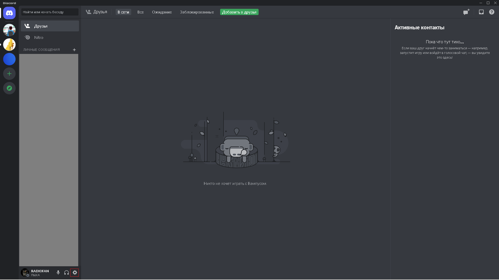  
- Перейти во (нажать на) вкладку Внешний вид (раздел Настройки приложения)  
  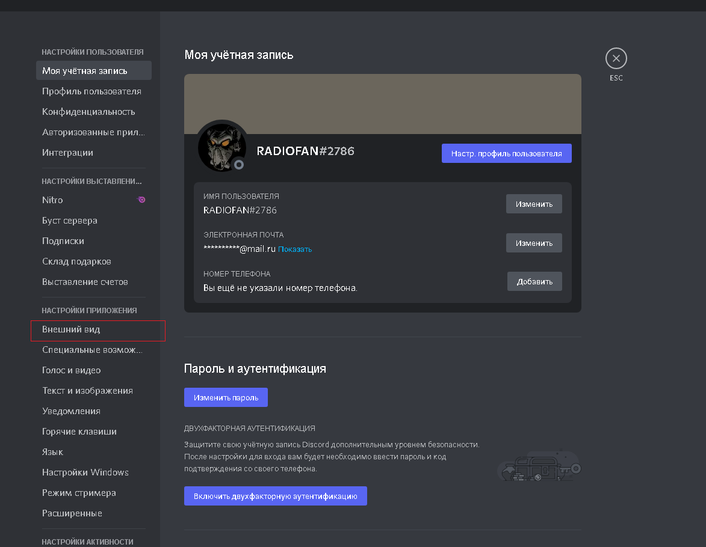  
- В открывшемся меню выбрать светлую тему, нажав на радиокнопку в разделе ТЕМА  
  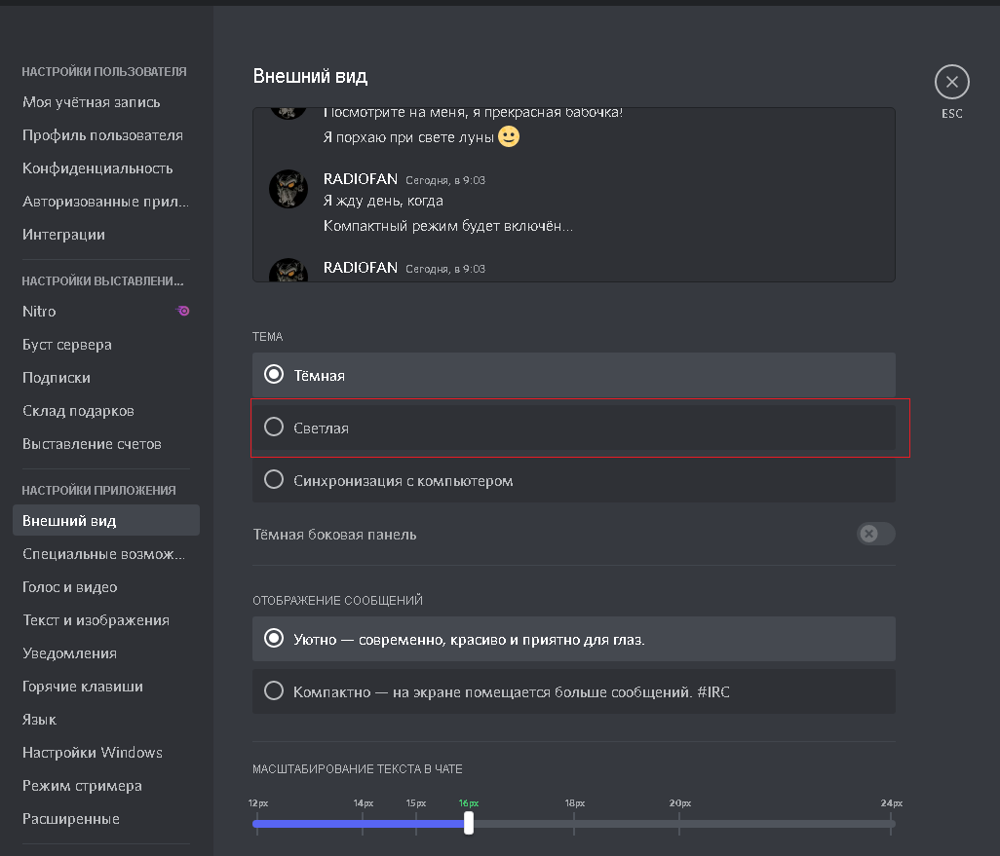  

_Постусловие_: светлая тема включена.  
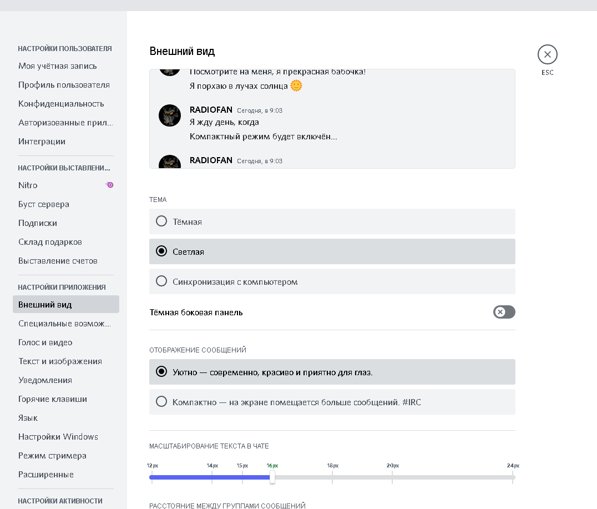

**Пользовательский сценарий 2**. Отправка запроса дружбы пользователю.  
_Действующее лицо_: Пользователь.  
_Предусловие_: приложение открыто и работает (не на тех.работах), добавляемый пользователь не является другом и существует.  
_Основной сценарий_:
- Открыть приложение.
- Во вкладке друзья нажать на кнопку Добавить в друзья.  
  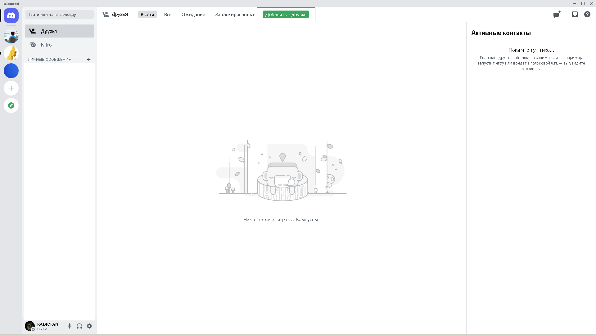
- В появившееся текстовое поле ввести тэг пользователя, нажать кнопку Отправить запрос дружбы  
  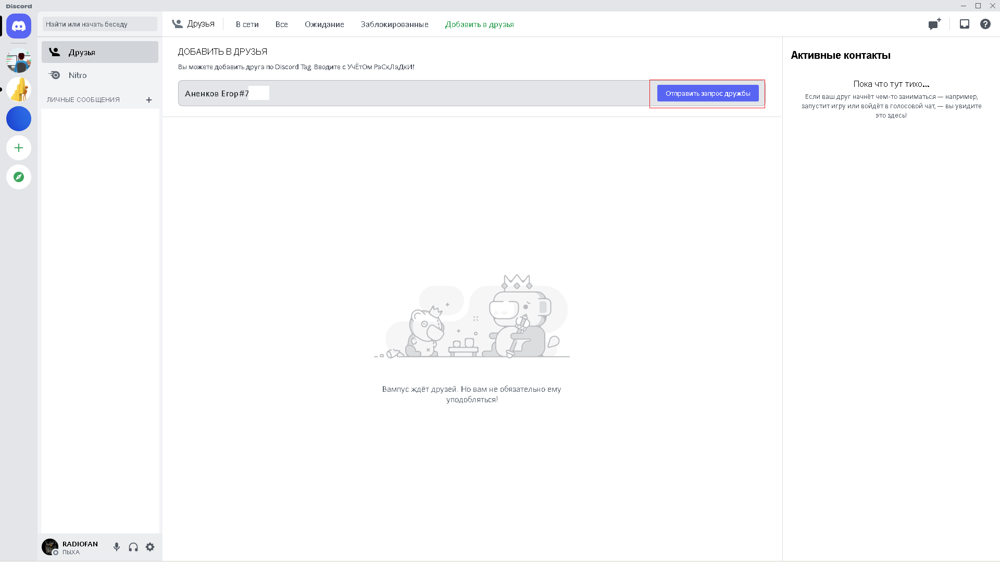

_Постусловие_: Запрос дружбы отправлен пользователю, пользователь добавлен во вкладку Ожидание.  
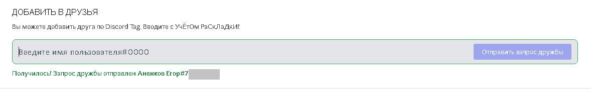
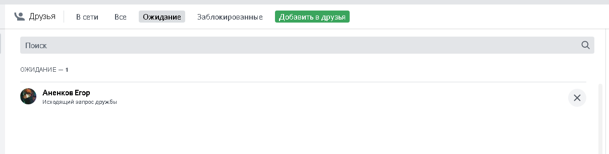

**Пользовательский сценарий 3**. Добавление нового участника на сервер.  
_Действующее лицо_: Пользователь.  
_Предусловие_: приложение открыто и работает (не на тех.работах), добавляемый пользователь не является участником сервера и существует.  
_Основной сценарий_:
- Открыть приложение.
- Во вкладке серверов перейти на сервер (нажать на его картинку).  
  
- В появившемся меню текстовых каналов выбрать тот, в который будет добавлен пользователь. Нажать на иконку добавления участника.  
  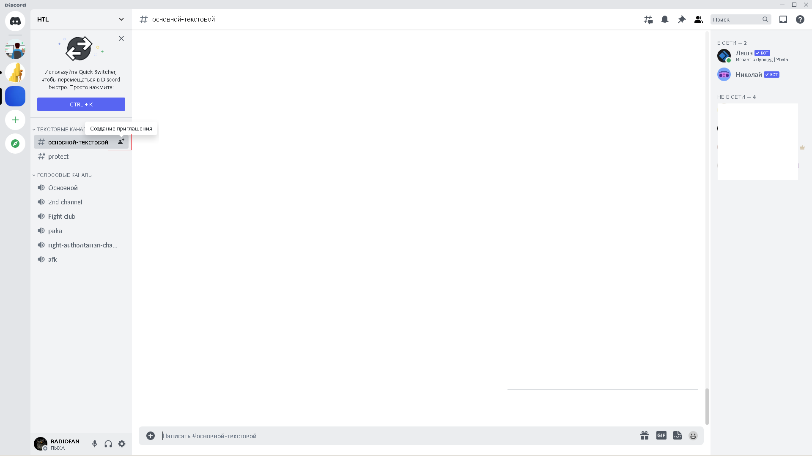
- В открывшемся окне произвести поиск пользователя путем введения его ника в текстовое поле поиска. Нажать на кнопку При... (Пригласить) в строке найденного пользователя.  
  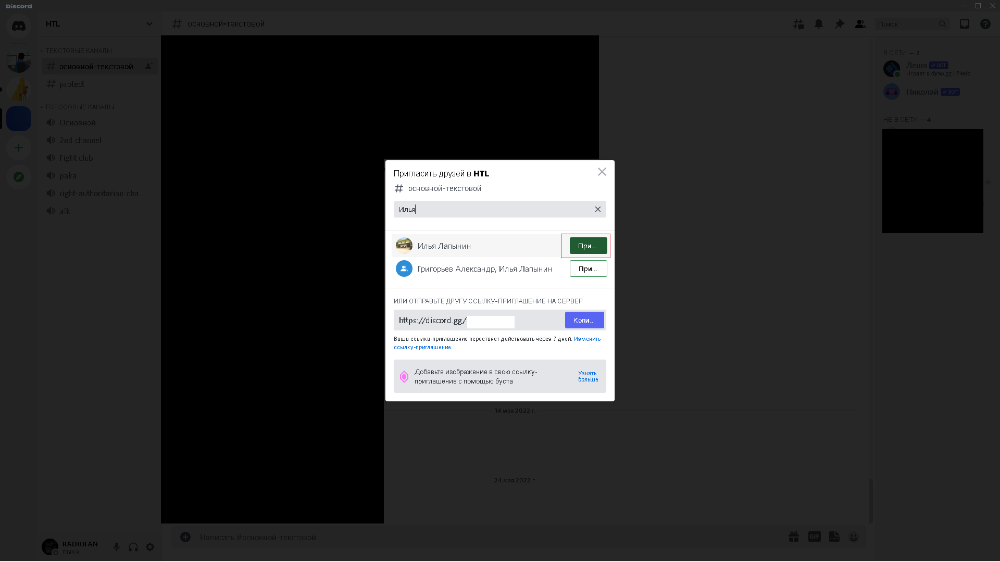

_Постусловие_: Кнопка При... (Пригласить) перестала быть активна. В личных сообщениях пользователю было отправлено приглашение стать участником сервера.  
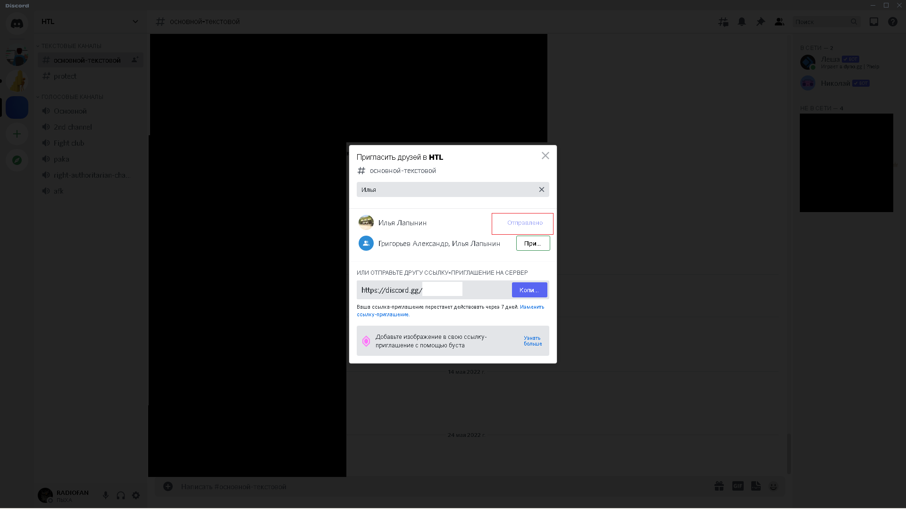
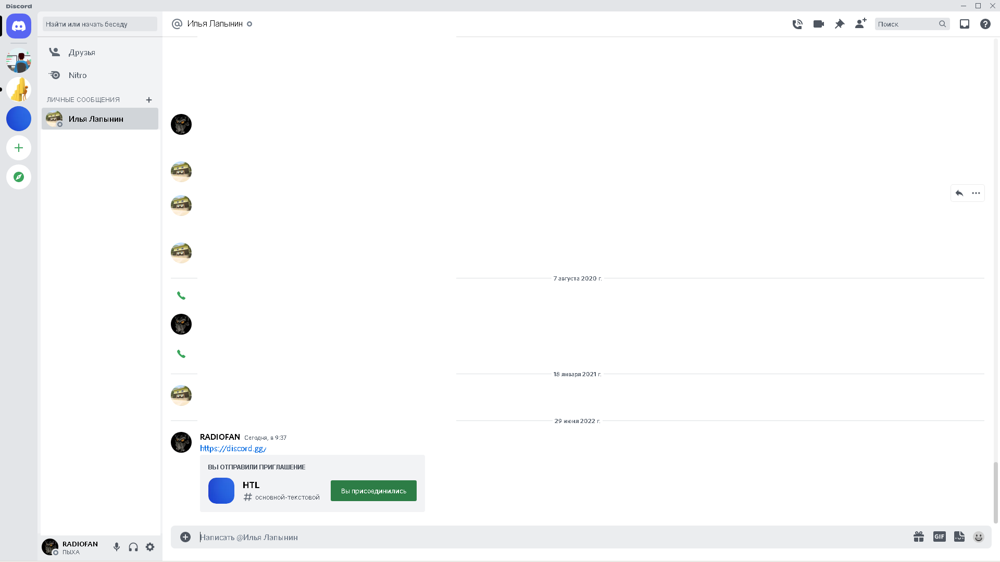

**Задание 2**. Создать спецификация в виде UseCase UML диаграмм.
