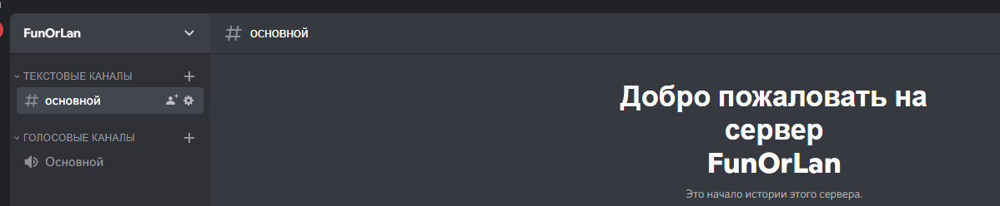
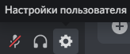
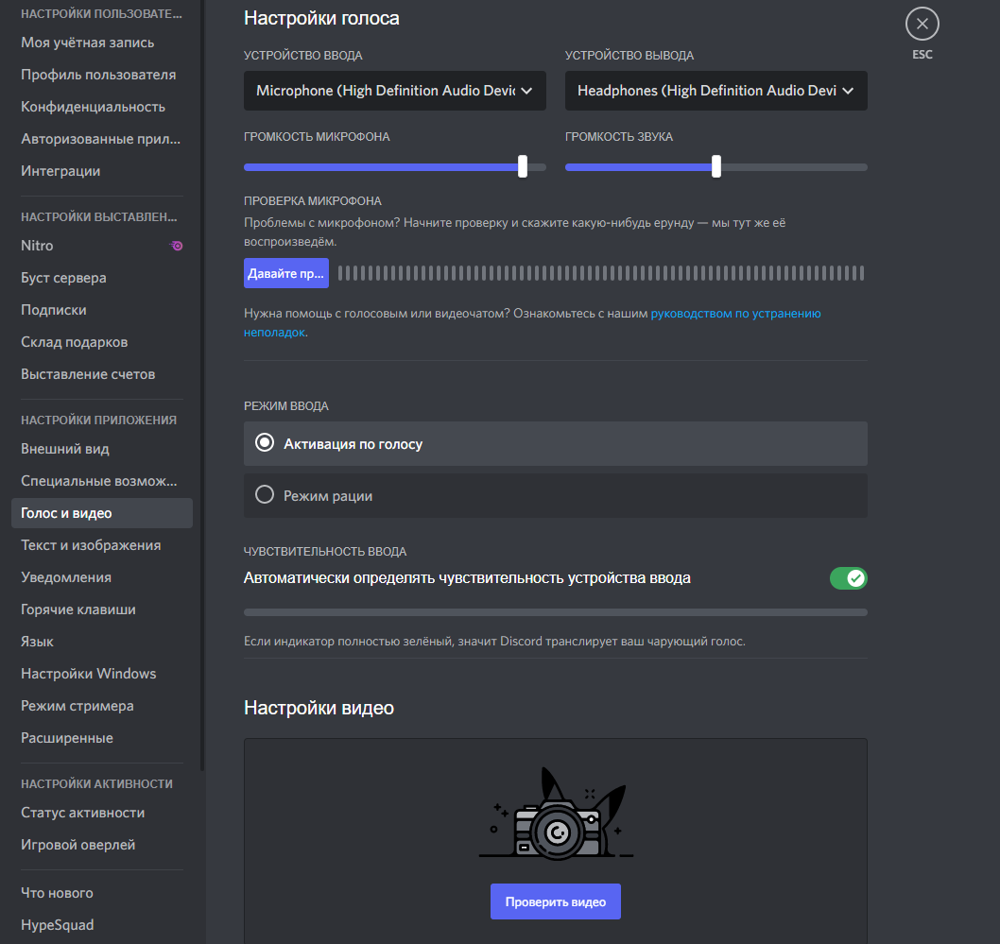
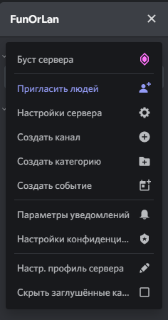
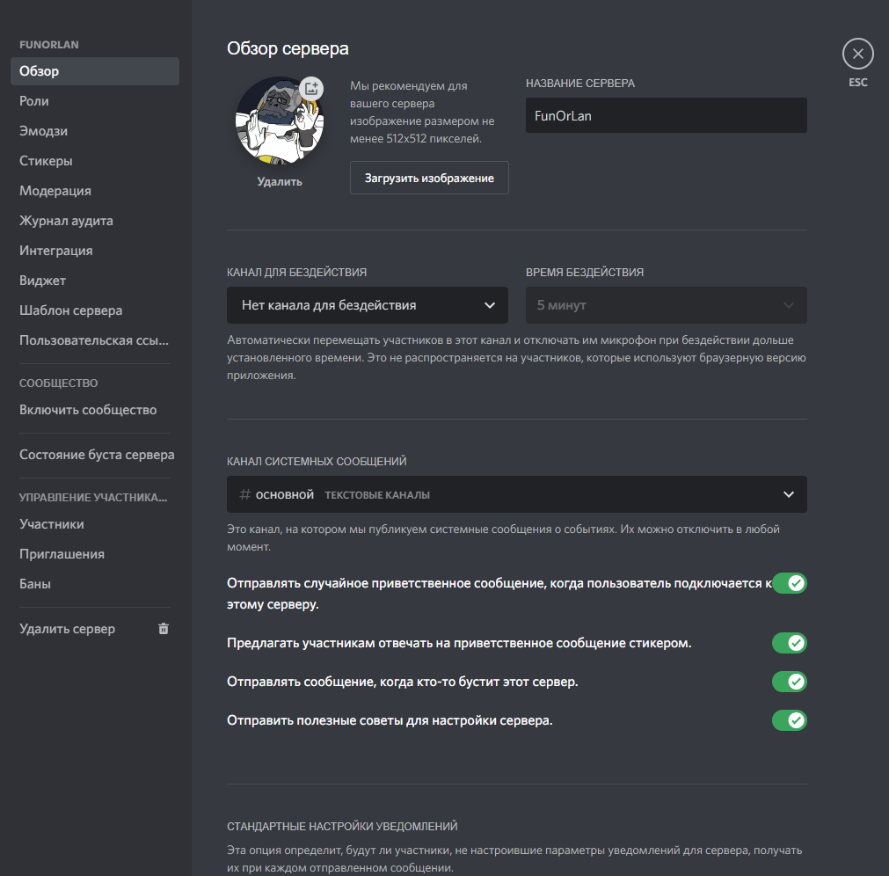
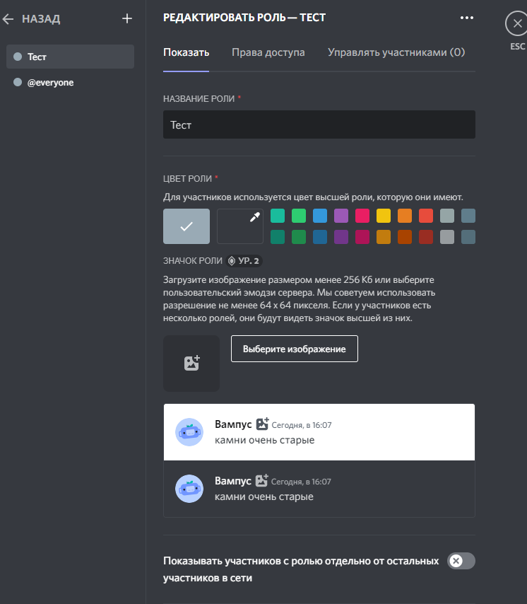

**Задание 1**: написать спецификацию в виде сценариев пользователя.  
**Инварианты**: главное окно видимо, доступны кнопки меню, ошибок не выдает, приложение не закрыто, интернет есть, приложение находиться не на тех.работах.

**Пользовательский сценарий 1**. Создание и настройка канала.  
_Действующее лицо_: Пользователь.  
_Предусловие_: приложение открыт и работает ( не на тех.работах ).  
_Основной сценарий_:
- Открыть приложение.
- В верхнем левом углу приложения нажать на кнопку  для создания беседы.
- Зайти в недавно созданную беседу. Нажатием на ее иконку в том же столбце где и кнопка по созданию беседы
- Перейдя в беседу зайти в автоматически созданный голосовой и текстовый канал для беседы.

**Пользовательский сценарий 2**. Изменения иконки профиля и настройка приложения.
_Действующее лицо_: Пользователь.  
_Предусловие_: приложение открыт и работает ( не на тех.работах ).  
_Основной сценарий_:
- Открыть приложение.
- Перейти во вкладку .
- Откроется развернутая настройка приложения с возможностью настройки ввода, вывода и другие подробных настроек.  

**Пользовательский сценарий 3**. Подробная настройка канала.  
_Действующее лицо_: Создатель канала, либо назначенный Администратор канала.  
_Предусловие_: приложение открыт и работает ( не на тех.работах ).  
_Основной сценарий_:
- Открыть приложение.
- Нажать на название канала и перейти в выпадающую вкладку меню “Настройка сервера”.  

- В открытой подробной настройки канала можно приступить к индивидуальной настройке.  

**Пользовательский сценарий 4**. Редактирование прав конкретных пользователей на канале.  
_Действующее лицо_: Администратор.  
_Предусловие_: приложение открыт и работает ( не на тех.работах ).  
_Основной сценарий_:
- Открыть приложение.
- Перейти в настройку ролей на канале.  

- Создать и настроить права для каждого человека, либо для заранее созданной группы людей.  

**Задание 2**. Создать спецификация в виде UseCase UML диаграмм.
